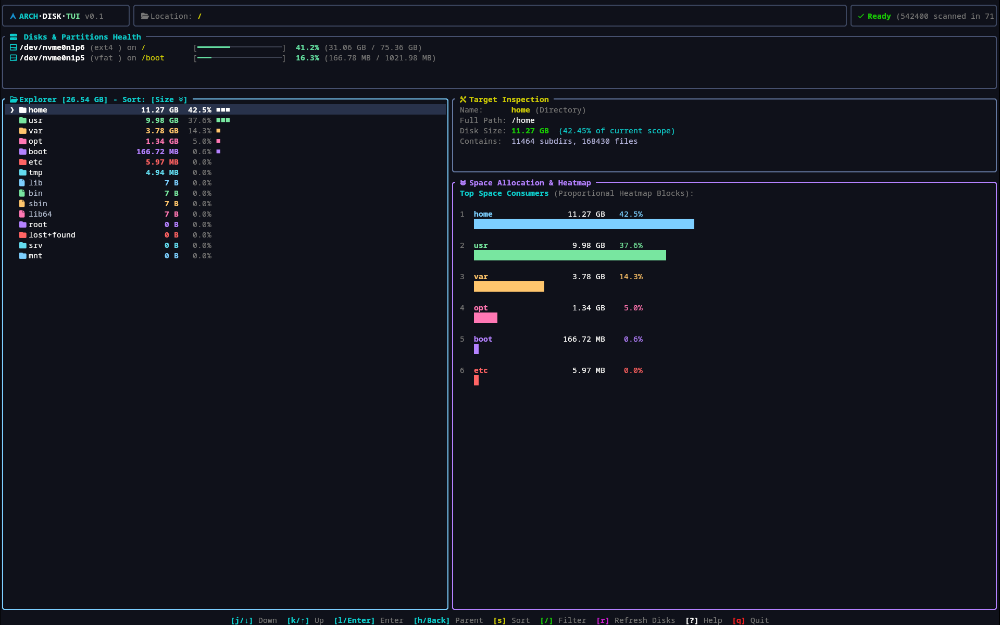

<div align="center">

  

  <br/><br/>

  <a href="https://github.com/emirkefi/arch-disk-tui">
    
  </a>

  <p align="center">
    <strong>A blazingly fast, modern, and aesthetic Terminal Disk Space Analyzer & Heatmap for Linux / Arch Linux</strong>
  </p>

  <p align="center">
    <a href="https://github.com/emirkefi/arch-disk-tui/stargazers"></a>
    <a href="https://github.com/emirkefi/arch-disk-tui/releases"></a>
    <a href="https://github.com/emirkefi/arch-disk-tui/blob/main/LICENSE"></a>
    <a href="https://www.rust-lang.org/"></a>
    <a href="https://archlinux.org"></a>
  </p>

  <p align="center">
    <a href="#-quick-install">🚀 Quick Install</a> •
    <a href="#-features">✨ Features</a> •
    <a href="#-interactive-keybindings">🎮 Controls</a> •
    <a href="#-uninstall">🗑️ Uninstall</a>
  </p>

</div>

---

## ⚡ Overview

**`arch-disk-tui`** is an ultra-performant, intuitive terminal disk analyzer engineered in Rust. Inspired by the speed of *WizTree* and the visual clarity of modern Unix tools, it delivers real-time non-blocking directory scanning, live partition health telemetry, Vim-style hierarchical navigation, and colorful proportional heatmap blocks.

### 🌟 Why arch-disk-tui?

<table>
  <tr>
    <td width="50%">
      <h3>🚀 Blazing Fast & Non-Blocking</h3>
      <ul>
        <li>Multi-threaded traversal powered by <code>jwalk</code></li>
        <li>Indexed <strong>540,000+ files in seconds</strong></li>
        <li>UI stays 100% responsive and snappy while indexing</li>
      </ul>
    </td>
    <td width="50%">
      <h3>🎨 Cyberpunk & Arch-Themed UI</h3>
      <ul>
        <li>Crafted with Ratatui and modern rounded borders</li>
        <li>Arch Ice Blue, Neon Pink, and Mint accents</li>
        <li>Proportional colored distribution heatmaps</li>
      </ul>
    </td>
  </tr>
  <tr>
    <td width="50%">
      <h3>📂 Deep Interactive Exploration</h3>
      <ul>
        <li>Vim keys (<code>h</code>, <code>j</code>, <code>k</code>, <code>l</code>) or Arrow keys</li>
        <li>Drill down into subdirectories or jump to parent in 1 keypress</li>
        <li>Real-time fuzzy search & filtering (<code>/</code>)</li>
      </ul>
    </td>
    <td width="50%">
      <h3>🛡️ Safe Linux Virtual FS Filtering</h3>
      <ul>
        <li>Automatically skips pseudo-filesystems (<code>/proc</code>, <code>/sys</code>, <code>/dev</code>, <code>/run</code>)</li>
        <li>No infinite recursion loops</li>
        <li>Zero phantom 128TB allocation glitches</li>
      </ul>
    </td>
  </tr>
</table>

---

## 🚀 Quick Install

### ⚡ One-Line Automated Installer
```bash
curl -fsSL https://raw.githubusercontent.com/emirkefi/arch-disk-tui/main/install.sh | bash
```

<details>
<summary><b>📦 Alternative Install Methods (Cargo, Source, Make)</b></summary>
<br/>

#### Option A: Build from Source
```bash
# 1. Clone the repository
git clone https://github.com/emirkefi/arch-disk-tui.git
cd arch-disk-tui

# 2. Build release binary
cargo build --release

# 3. Run
./target/release/arch-disk-tui
```

#### Option B: Direct Cargo Install
```bash
cargo install --path .
```

#### Option C: Standard Makefile
```bash
make
sudo make install
```

</details>

---

## 🎮 Interactive Keybindings

<div align="center">

| Shortcut | Description | Action |
|:---:|:---|:---|
| <kbd>j</kbd> / <kbd>↓</kbd> | Move Selection Down | Navigate current directory items |
| <kbd>k</kbd> / <kbd>↑</kbd> | Move Selection Up | Navigate current directory items |
| <kbd>l</kbd> / <kbd>Enter</kbd> | Drill Down | Enter highlighted directory |
| <kbd>h</kbd> / <kbd>Backspace</kbd> | Navigate Back | Return to parent directory |
| <kbd>s</kbd> | Cycle Sort Order | Switch between **Size 󰄼**, **Name 󰄾**, and **Count** |
| <kbd>/</kbd> | Live Search Filter | Instant real-time regex/name search |
| <kbd>Esc</kbd> | Dismiss | Clear search query or close dialogs |
| <kbd>r</kbd> | Refresh Drives | Poll live filesystem storage metrics |
| <kbd>?</kbd> | Cheatsheet | Open interactive modal help window |
| <kbd>q</kbd> | Safe Exit | Restore terminal state and exit |

</div>

---

## 🎯 Usage Examples

```bash
# Scan current directory
arch-disk-tui

# Scan root partition
arch-disk-tui /

# Scan home folder
arch-disk-tui ~

# Check build help
arch-disk-tui --help
```

---

## 🗑️ Uninstall

Cleanly remove `arch-disk-tui` with one command:

```bash
# Using the automated uninstaller
./uninstall.sh

# Or via remote curl
curl -fsSL https://raw.githubusercontent.com/emirkefi/arch-disk-tui/main/uninstall.sh | bash
```

Or via Makefile:
```bash
sudo make uninstall
```

---

<div align="center">

  Made with ❤️ for Arch Linux & Rust enthusiasts by <a href="https://github.com/emirkefi"><strong>Emir</strong></a>

  <br/>

  <a href="#arch-disk-tui">⬆ Back to Top</a>

</div>
